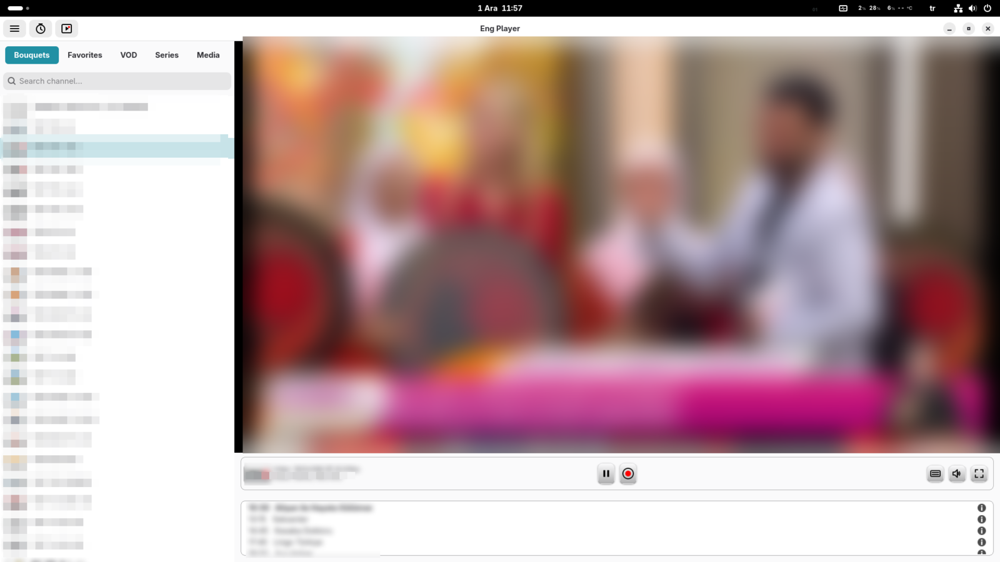
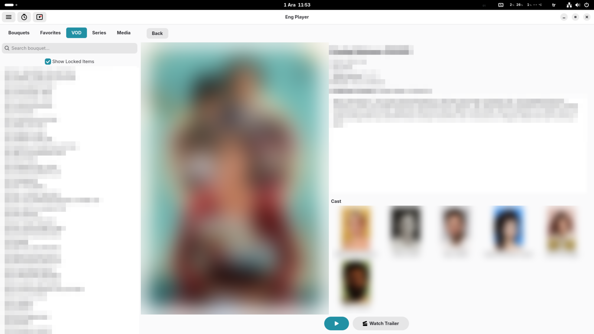
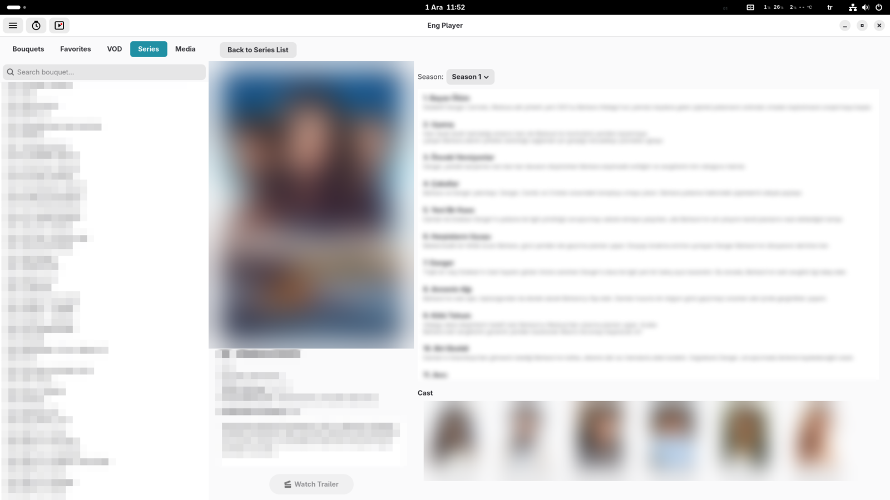
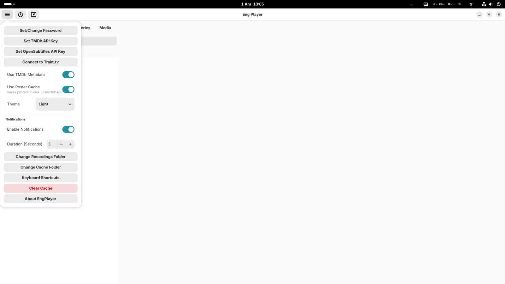
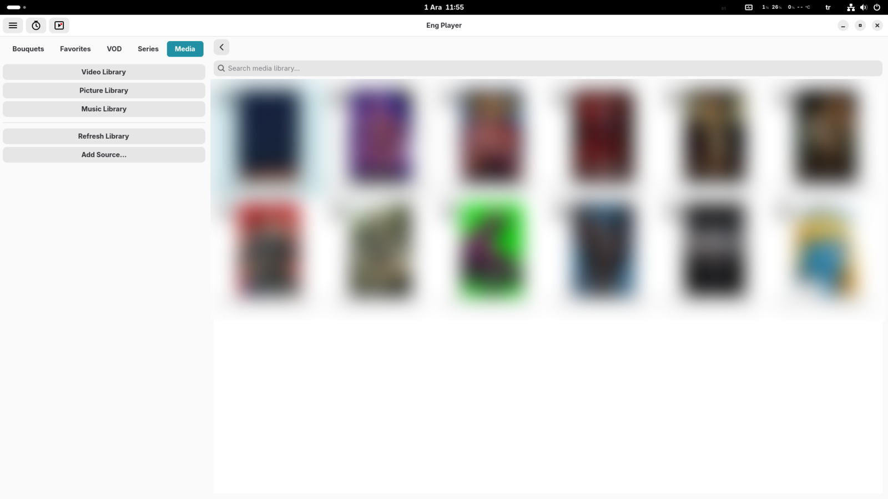

<p align="center">
  
</p>

📺 EngPlayer - Modern IPTV and Media Center

EngPlayer is a modern, fast, and lightweight media player developed with Python and GTK4 (LibAdwaita) for Linux desktop environments.

It is not just an IPTV player; it is a user-friendly entertainment hub that brings your local media library, VOD content, and live streams under one roof. It combines the power of GStreamer and the flexibility of FFmpeg with a stylish interface.

🚀 Recommendation for Full Experience: To utilize all features efficiently (Movie posters, plots, cast info, and auto-subtitle downloading), it is recommended to enter your TMDb API and OpenSubtitles API keys in the settings menu.

✨ Key Features
📡 Advanced IPTV and Broadcasting Support
Multi-Profile Support: Easy switching between Xtream Codes API and M3U (URL/File) playlists.

Smart Match & Cleanup: Automatically cleans unnecessary tags (e.g., |TR|, [FHD], (Backup)) from channel names. It scans externally loaded logo folders or EPG files and uses Fuzzy Logic technology to match channels with the correct logos and program guides, even if the names do not match 100%.

Smart EPG (Electronic Program Guide): XMLTV support, real-time program tracking, and past broadcast information.

Catch-up (Archive) Support: Ability to watch past broadcasts on supported channels (Automatic detection).

Channel Management: Create favorite lists, move and sort channels.

Security: Lock private channels or adult-content bouquets with a PIN code.

🎬 VOD and Series Integration
Cinematic Interface: Posters, descriptions, cast, and rating information for Movies and Series.

TMDb Integration: Automatically fetches content metadata (Posters, Plots, Trailers, etc.) via TheMovieDB.

Trakt.tv Synchronization: Automatically processes watched movies and series to your Trakt profile (Scrobbling).

Smart Search: Finds the most accurate results among contents using "Fuzzy Logic".

🛠 Powerful Player and Tools
Advanced Playback: GStreamer-based, hardware-accelerated smooth 4K/1080p playback.

Recording (PVR): Record live broadcasts instantly or schedule them for a later date via the Scheduler. (Works in the background via a system service even when the app is closed).

Picture-in-Picture (PiP): Continue watching the stream in a small window while working on other tasks.

Audio Control: 10-Band Equalizer and preset audio profiles (Rock, Pop, Jazz, etc.).

Subtitle Support: Embedded subtitles, external file loading, and automatic download via OpenSubtitles.

📂 Local Media Library
Scans Video, Music, and Picture folders on your computer to create a library.

Smart Resume: Never lose your spot. Automatically saves playback progress for Movies, TV Series, and Local Media files. You can resume watching exactly where you left off.

Album art and metadata support for music files.

Slideshow mode for pictures.

⚙️ Technical Requirements
EngPlayer uses modern Linux technologies. To compile or run, your system needs the following components:

System Components
Python: 3.10 or higher

Interface: GTK4 4.10+ and LibAdwaita

Media Engine: GStreamer (with Base, Good, Bad, Ugly, and LibAV plugins)

Recording Engine: FFmpeg (Mandatory for recording features)

Python Libraries
Basic modules required for the application to run (available in requirements.txt):

PyGObject

requests

yt-dlp

mutagen

thefuzz (or fuzzywuzzy)

python-Levenshtein

guessit

📸 Screenshots

<p align="center">
  
  
</p>
<p align="center">
  
  
</p>
<p align="center">
  
  
</p>


🚀 Installation

⚠️ Important Note
For the best experience with **hardware acceleration** and **all video codecs** pre-configured, we strongly recommend using the **Flatpak** version. Manual installation depends heavily on your system's libraries.

1. Install System Dependencies
Debian / Ubuntu / Mint:

```bash
sudo apt install -y \
    python3-dev python3-venv python3-pip python3-gi python3-gi-cairo \
    gcc pkg-config libcairo2-dev libgirepository-2.0-dev \
    gir1.2-gtk-4.0 gir1.2-adw-1 gettext \
    gir1.2-gstreamer-1.0 gstreamer1.0-gtk4 \
    ffmpeg \
    gstreamer1.0-plugins-base gstreamer1.0-plugins-good \
    gstreamer1.0-plugins-bad gstreamer1.0-plugins-ugly \
    gstreamer1.0-libav gstreamer1.0-tools gstreamer1.0-vaapi
```

Arch Linux / Manjaro:

```bash
sudo pacman -S --needed \
    base-devel git python python-pip \
    gtk4 libadwaita python-gobject gettext \
    ffmpeg \
    gstreamer gst-plugins-base gst-plugins-good \
    gst-plugins-bad gst-plugins-ugly gst-libav \
    gst-plugin-gtk4 gstreamer-vaapi
```

Fedora Workstation:

⚖️ Legal Notice: Enabling RPM Fusion allows the installation of non-free codecs (like H.264/HEVC). Ensuring compliance with local laws is your responsibility.

```bash
sudo dnf install -y https://mirrors.rpmfusion.org/free/fedora/rpmfusion-free-release-$(rpm -E %fedora).noarch.rpm https://mirrors.rpmfusion.org/nonfree/fedora/rpmfusion-nonfree-release-$(rpm -E %fedora).noarch.rpm
```

```bash
sudo dnf install -y python3-devel gcc pkg-config \
    gtk4-devel libadwaita-devel gobject-introspection-devel \
    cairo-gobject-devel cairo-devel \
    python3-gobject gettext \
    ffmpeg \
    gstreamer1-plugins-base gstreamer1-plugins-good \
    gstreamer1-plugins-bad-free gstreamer1-plugins-ugly-free \
    gstreamer1-libav gstreamer1-vaapi gstreamer1-plugin-gtk4
```

# 3. Fix Hardware Acceleration (Install drivers matching your GPU)
# Intel Users:
```bash
sudo dnf install -y intel-media-driver libva-intel-driver
```
# AMD Users (Unlock VA-API):
```bash
sudo dnf swap -y mesa-va-drivers mesa-va-drivers-freeworld
sudo dnf swap -y mesa-vdpau-drivers mesa-vdpau-drivers-freeworld
```
---

🚀 Installation

You can install it in user mode by opening a terminal in the project directory (requires make and dependencies installed):
```bash
make install-manual
```
This command installs the application to ~/.local/share/engplayer, sets up an isolated Python virtual environment, and adds the menu shortcut.

Uninstall
To completely remove the application, stop the background service, and clean up all data:
```bash
make uninstall
```
Warning: This command will also delete your user configuration, databases, and cached images.

---

📜 License
EngPlayer is distributed as Proprietary Freeware.

By downloading or using this software, you agree to the terms in the LICENSE file.

✅ Free for Personal Use: You are welcome to download, install, and use this software for personal entertainment free of charge.

⚠️ No Commercial Use: Commercial distribution, selling, renting, or including this software in paid bundles is not permitted.

⚠️ No Porting: To ensure quality and focus, porting or modifying this software for other operating systems (Windows, macOS, Android, etc.) is not allowed without prior written permission.

For full terms and conditions, please refer to the LICENSE file included in this repository.

⚖️ Legal Disclaimer
EngPlayer is a media player software. It does not provide, include, or distribute any playlists, IPTV channels, video streams, or digital content. Providing content is solely the user's responsibility. The developer assumes no liability for the content viewed by the user.

📢 Acknowledgments


This product uses the TMDb API but is not endorsed or certified by TMDb.

---
*Developed by Engin Eren*
